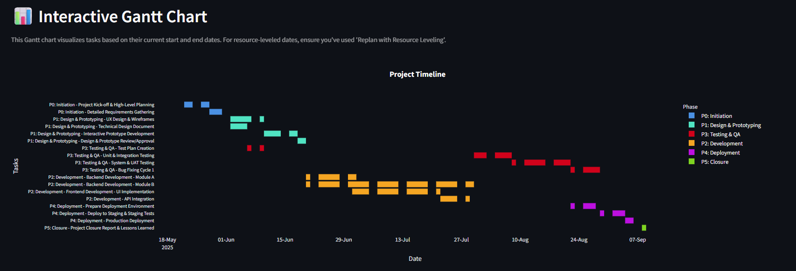
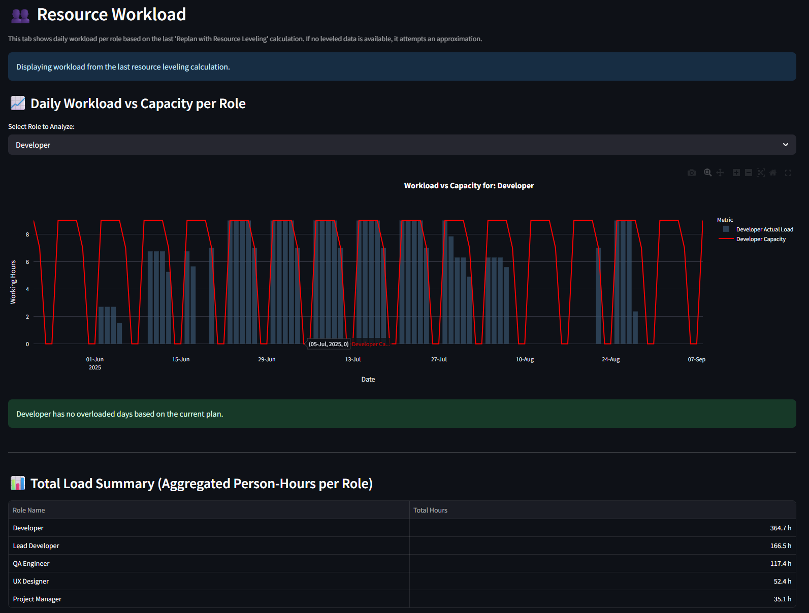
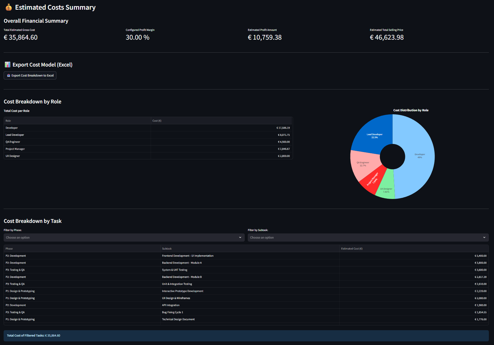
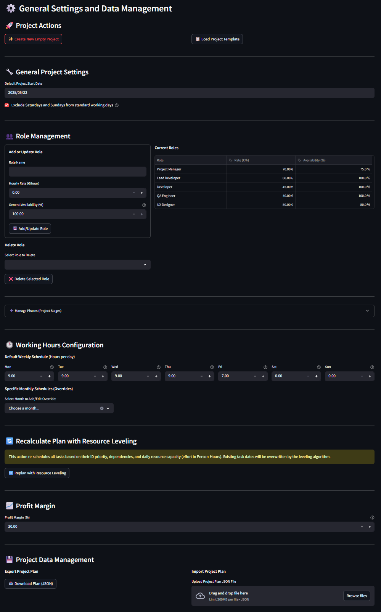

# 🚀 Project Planner - Advanced Resource & Task Scheduler


> **Visual project planning, resource leveling, cost estimation and Gantt charts — all in one app.**

## 🧠 Overview

**Advanced Project Planner** is a powerful Streamlit-based application designed for project managers, engineers, and team leaders. It simplifies complex project planning by integrating:

- Task scheduling with detailed effort (Person-Hours) and dependency tracking.
- Role-based resource assignments with specific allocations.
- Sophisticated, effort-based resource leveling considering daily availability.
- Customizable working calendars with weekly defaults and monthly overrides.
- Interactive Gantt charts for timeline visualization.
- Dependency graphing.
- Resource workload analysis.
- Comprehensive cost estimation and breakdown, with Excel export capabilities.

## 🌟 Features

### ✅ Task Management
- Add, edit, and organize tasks into Phases (project stages).
- Define task effort in Person-Hours (PH).
- Set start dates and manage dependencies between tasks.
- Track task status (Pending, In Progress, Completed, etc.).
- Assign multiple roles to tasks with specific allocation percentages for that task.
- Add detailed notes to each task.

### 📅 Intelligent Scheduling
- **Effort-Based Duration**: Task durations are dynamically estimated based on total effort and the combined capacity of assigned resources.

- Customizable Working Calendar:
  - Define a default weekly working schedule (hours per day).
  - Implement monthly overrides for specific working patterns (e.g., summer hours).
  - Option to include or exclude weekends as standard working days.

- **Dependency-Aware Scheduling**: Automatically calculates task start dates based on the completion of predecessor tasks.

- **Resource Leveling (Effort-Based)**:
  - Reschedules tasks considering task dependencies and daily resource capacity.
  - Capacity is derived from role availability, system working hours, and effort already scheduled on other tasks.
  - Attempts to resolve resource overloads by shifting tasks according to their ID priority.

### 📈 Interactive Gantt Charts
- Timeline view with tasks colored by their Phase.
- Hover tooltips display task details including duration, assignments, cost, dependencies, and status.
- Visualizes actual working segments, skipping non-working days.

### 🔗 Dependency Graph
- Visualizes task relationships and dependencies as a clear flowchart using Graphviz.

### 👥 Resource Load Visualization
- Analyze daily workload (in hours) per role against their calculated capacity.
- Highlights potential resource overloads.
- Provides a summary of total person-hours per role.

### 💰 Cost Analysis
- Calculates task costs based on effort, role assignments, and defined hourly rates.
- Provides an overall project financial summary including gross cost, profit margin, and selling price.
- Detailed cost breakdown by role and by task.
- **Export Cost Model to Excel**: Generates a multi-sheet Excel file with costs per phase, per task (with role dedications), and project parameters.

### 💾 Data Management
- Create new empty projects.
- Load a sample AI project template to get started quickly.
- Export and import complete project plans in JSON format, preserving all settings, tasks, roles, and phases.


## 🛠️ How It Works

The application is built within a single Python script (`project_planner.py`) using Streamlit for the user interface and Pandas/Plotly for data manipulation and visualization.

- **Streamlit UI**: Provides the interactive front-end for users to define project parameters, manage tasks, trigger calculations, and view results.

- **Planning Engine (Integrated)**:
  - Calculates task durations based on effort and resource allocation.
  - Determines task end dates considering working calendars.
  - Performs resource leveling by iteratively scheduling tasks based on dependencies and daily resource availability.
  - Computes costs and generates data for visualizations.


## 🖼️ Screenshots

### 📊 Gantt Chart View  
> Colored by macro-phase, shows start/end, assignments, and dependencies.

### 💼 Resource Allocation View  
> Daily workload distribution for each role.


### 💰 Cost Breakdown  
> Understand where your budget is going in a simple and clear format.


### ⚙️ Settings Panel
> The configuration interface for roles, phases, working hours, and project defaults.


## 🧩 JSON Structure

Your project plan can be saved and loaded as a JSON file. The main keys are:
- `roles`: Defines each role, their availability_percent, and rate_eur_hr.
- `tasks`: A list of tasks, each with:
  - `id`: Unique identifier.
  - ``phase``: The name of the phase the task belongs to.
  - ``subtask``: Specific name of the subtask.
  - ``phase_color``: Hex color code for the phase.
  - ``name``: Auto-generated full name (Phase - Subtask).
  - ``start_date``: ISO format date string (YYYY-MM-DD).
  - ``effort_ph``: Estimated person-hours for the task.
  - ``duration_calc_days``: Calculated duration in working days (float).
  - ``assignments``: List of dictionaries, e.g., [{"role": "AI Engineer", "allocation": 50.0}].
  - ``dependencies``: JSON string of a list of prerequisite task IDs, e.g., "[1, 2]".
  - ``status``: Current task status.
  - ``notes``: Additional information.
  - ``end_date``: Calculated end date in ISO format (populated after planning/leveling).
- ``next_task_id``: The next available ID for new tasks.
- `config`: Project-level settings:
  - ``project_start_date``: ISO format date string.
  - ``exclude_weekends``: Boolean.
  - ``working_hours``: Contains default weekly schedule and monthly_overrides.
  - ``profit_margin_percent``: Float.
- ``phases``: A dictionary mapping phase names to their hex color codes, e.g., {"Design Phase": "#ADD8E6"}.

Example Snnipet:
```json
{
  "roles": {
    "AI Engineer": {
      "availability_percent": 100.0,
      "rate_eur_hr": 40.0
    },
    "Tech Lead": {
      "availability_percent": 50.0,
      "rate_eur_hr": 60.0
    }
  },
  "tasks": [
    {
      "id": 1,
      "phase": "Research",
      "subtask": "Literature Review",
      "phase_color": "#FFA500",
      "name": "Research - Literature Review",
      "start_date": "2025-06-01",
      "effort_ph": 40.0,
      "duration_calc_days": 5.0, // Example, would be calculated
      "assignments": [{"role": "AI Engineer", "allocation": 100.0}],
      "dependencies": "[]",
      "status": "Pending",
      "notes": "Review SOTA papers.",
      "end_date": "2025-06-07" // Example, would be calculated
    }
  ],
  "next_task_id": 2,
  "config": {
    "project_start_date": "2025-06-01",
    "exclude_weekends": true,
    "working_hours": {
      "default": {"Monday": 8.0, /* ... */ "Sunday": 0.0},
      "monthly_overrides": {}
    },
    "profit_margin_percent": 20.0
  },
  "phases": {
    "Research": "#FFA500",
    "Development": "#ADD8E6"
  }
}
```


## ▶️ How to Run

1. **Clone the repository**  
   ```bash
   git clone https://github.com/asferrer/project_planner_app
   cd project_planner_app
   ```

2. **Install dependencies**  
   Make sure Python 3.8+ and pip are installed.
   ```bash
   pip install -r requirements.txt
   ```

3. **Launch the app**
   ```bash
   streamlit run project_planner.py
   ```

## 🧪 Demo Templates
The application includes a sample "AI Project Template" that can be loaded from the "Settings/Data" tab. This template features:
- Predefined roles like "Tech Lead," "AI Engineer," and "Senior AI Engineer."
- A set of tasks organized into phases, with effort, dependencies, and assignments.
- This allows for a quick start and demonstration of the planner's capabilities. Quickly load it from the app interface and start customizing!

## 📂 Folder Structure

```
.
├── project_planner.py       # Streamlit interface
├── gant_generator.py        # Scheduling logic
├── requirements.txt         # Dependencies
└── README.md                # This file
```

## 📝 License

This project is licensed under the [MIT License](LICENSE).


## ❤️ Credits

If you find this project useful, please consider starring⭐ the repository and sharing it.
Contributions, bug reports, and feature suggestions are welcome! Please open an issue or submit a pull request if you're working from a Git repository.
